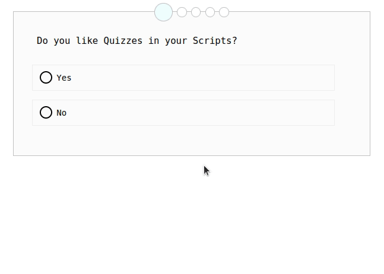

# interactive-textbooks
[](https://github.com/se-tuebingen/interactive-textbooks/actions/workflows/publish.yml)

## Demo



## What can this module do?

With this module, you can create simple HTML quizzes (questionnaires) with single- or multiplechoice questions by
- providing HTML with custom tags (HTML5)
- and including a single JavaScript file

There is also a module for Scribble (the Racket documentation tool), which not only generates the correct HTML, but also printable LaTex code in a custom location with the solutions as rotated text.

## How to use

### JavaScript module

[Demo](https://se-tuebingen.github.io/interactive-textbooks/javascript-plugin/questionnaire-test.html) | [Source](https://github.com/se-tuebingen/interactive-textbooks/blob/master/tests/javascript-plugin/questionnaire-test.html)


In order to use the JavaScript module, one only needs to create HTML in the correct format and include the script somewhere on the page:
```html
<!-- prevent questionnaire from showing up if there is no javascript enabled-->
<noscript><style>questionnaire { display: none; }</style></noscript>
<!-- warning for user - feel free to leave out or customize -->
<noscript><div>Enable JavaScript to see the quiz</div></noscript>

<questionnaire language="en | de"><!-- language is optional, default is English -->
  <question type="singlechoice | multiplechoice"><!-- type is optional, will be inferred from number of solutions otherwise -->
    Question Text
    <distractor>
      Wrong Answer Text
      <explanation>Explanation Text</explanation>
    </distractor>
    <solution>
      Correct answer text
      <!-- explanation is optional -->
    </solution>
    <!-- etc.. -->
  </question>
  <!-- etc. ... -->
</questionnaire>

<!-- somewhere else in the same document -->
<script src="questionnaire.js"></script>
```

### Scribble-Plugin

[Demo](https://se-tuebingen.github.io/interactive-textbooks/scribble-plugin/output/html/test/) | [Source](https://github.com/se-tuebingen/interactive-textbooks/blob/master/tests/scribble-plugin/test.scrbl)

Copy the Scribble-Plugin and the JavaScript-Plugin (`questionnaire.rkt` *and* `questionnaire.js`) to your source folder and import it with
```scribble
@(require "questionnaire.rkt")
```

You can generate your questions much in the same style as in the HTML document. The `@q` helper does not change the input, but enables you to use content notation while producing a racket argument (more on that [here](https://docs.racket-lang.org/scribble/reader.html)).
```scribble
@questionnaire[#:language "en" @; or "de" (optional, default: "en")
  @question[
    "Question Text"
    @solution{correct answer}
    @distractor{wrong answer}
  ]
  @question[
    #:type "multiplechoice" @; or "singlechoice" (optional, inferred otherwise)
    @q{Question Text with some @italic{formatting}}

    @solution{correct answer}
    @explanation{optional explanation for correct answer}

    @distractor{wrong answer}

    @explanation{optional explanation for wrong answer}
    @solution{another correct solution}
  ]
]
@texquestions[]
```

Whether a question is multiple- or singlechoice is automatically inferred by the JavaScript PlugIn depending on the number of solutions. If you want to manually set the mode instead, you can give `@question` a `#:type` keyword argument of either `"singlechoice"` or `"multiplechoice"`.

For your questions to show up in a PDF, you need to specify where they should be rendered.
- A simple `@texquestions[]` renders the last `@questionnaire` that was defined above it. _If `@texquestions[]` is not called, the code for generating the latex for a question will not be run._
- Using this several times will produce a warning, which can be safely ignored (`WARNING: collected information for key multiple times: '(QuestionnaireDefaultQuestionnaire #t);`)
- If you have several questionnaires and want to e.g. move them to a separate section at the end, you need to specify a key as a keyword argument to both commands: `@texquestions[#:key "intro"]` renders what has been defined in `@questionnaire[#:key "intro" ...]`.

There are also some styling options for the LaTex output that can be passed as keyword arguments to `@texquestions`:
- `#:texsolutionstyle` Where the solution is added:
  - `"margin"` (default) in the margin beside the questions
  - `"inline"` below the questions
- `#:explain` Whether to include explanations in the solution (default: `#t`)

The `@pdf-note{}`-helper is a `@margin-note{}` that only shows up when the render target is latex/pdf.

### Customizing Styles

The CSS style sheet (`src/ressources/style.css`) is mainly concerned with layout and color. _The **content** and typography of questions, answers and explanations are **left as-is** as far as possible_, only the font size of the question is changed.

The style sheet is added to the head of the HTML document. The containing styles are all scoped to the `questionnaire` element.

- In order to overwrite styles or CSS variables, you need to either define them after the stylesheet (i.e. in a `<style>` tag somewhere in your document, but outside of the questionnaire) and be at least as specific, or be more specific (e.g. by giving the questionnaire a class)._Adding a class to a question, answer or explanation will **not work**, since these elements are destroyed and recreated during the processing of the questionnaire!_

- **Colors are defined via [CSS Variables](https://www.w3schools.com/css/css3_variables.asp)** so that they can be changed more easily. _For a full list of variables, refer to the source at `src/ressources/style.css`, as it may change between versions._

**For an instructive example, see [the source of the HTML demo page](https://github.com/se-tuebingen/interactive-textbooks/blob/master/tests/javascript-plugin/questionnaire-test.html).**

## Development

### Requirements

For the JavaScript module, [TypeScript](https://www.typescriptlang.org/download) is required. Once you have [nodejs](https://nodejs.org/en/download/) installed, you can simply run `npm install -g typescript`.

For the Scribble module, you need to have [Racket](https://download.racket-lang.org/) installed. For PDF-Generation, you also need to have LaTex installed, more specifically on Linux Systems the `texlive-extra` and `texlive-fonts-extra` packages, on Mac Systems via the Homebrew-Installer `texlive`. _Note that on MacOS, you need to run `raco scribble` instead of `scribble` to compile documents (works fine with linux, too, and is the default in the provided scripts)._

For the time being, this repository uses bash for helper scripts, which should work fine on Linux and Mac Systems, for Windows users an emulator like Cygwin or Mingw should do.

### Compilation and Targets

Executing `tsc` in project root creates the single-file drop-in questionnaire module from the `src` folder.

Because the goal is to provide on single JavaScript file, Styles and SVG icons are provided as String ressources in `ressources.ts`.
This module is generated from the contents of the `ressources` folder (`style.css` and the `svg`-files in the `icons` folder) by running `bundle-ressources.sh`.
So any changes in those files are only applied after running this script!

For ease of use, there is also a Makefile, so you can simply
run
- `make all` to bundle ressources and compile the JavaScript plugin, and
- `make test` to execute the tests - currently this only compiles a scribble test document in pdf and html

### Tests

- `questionnaire-test.html` loads the JavaScript plugin into a plain HTML page.
- `error-fail-testcase.html` demonstrates what happens if you provide incorrect HTML
- Executing `make test` or running `test.sh` in the `scribble-plugin` folder tests the Scribble plugin and generates PDF- and HTML output.

## Ressources

### CSS

[CSS named colors list](https://www.quackit.com/css/color/charts/css_color_names_chart.cfm)

[CSS Flexbox guide](https://css-tricks.com/snippets/css/a-guide-to-flexbox/)

### Scribble etc

[Overview of Scribble Document Types](https://docs.racket-lang.org/scribble/core.html#%28part._parts%29) - Everything Scribble-Related should be in the same documentation.

[Racket Documentation about Pairs and Lists](https://docs.racket-lang.org/guide/pairs.html) - for anything else it should suffice to enter the function name into the search box.

[Variable Arity Expressions in Racket](https://stackoverflow.com/questions/65873698/using-variable-arity-function-on-values-expression)

[Keyword Arguments in Racket](https://riptutorial.com/racket/example/8681/keyword-arguments)

For moving document parts around in Scribble, see e.g. the
[delayed block](https://docs.racket-lang.org/scribble/core.html#%28def._%28%28lib._scribble%2Fcore..rkt%29._delayed-block%29%29) documentation. Saving stuff in a LaTex variable and accessing it later is impossible because the Top Scribble Document Element needs to be a block, which translates Custom Latex Properties to an environment, which cannot generate a `\def\variable{}` command.

## MacOS Support
- Running `raco scribble` instead of `scribble`
